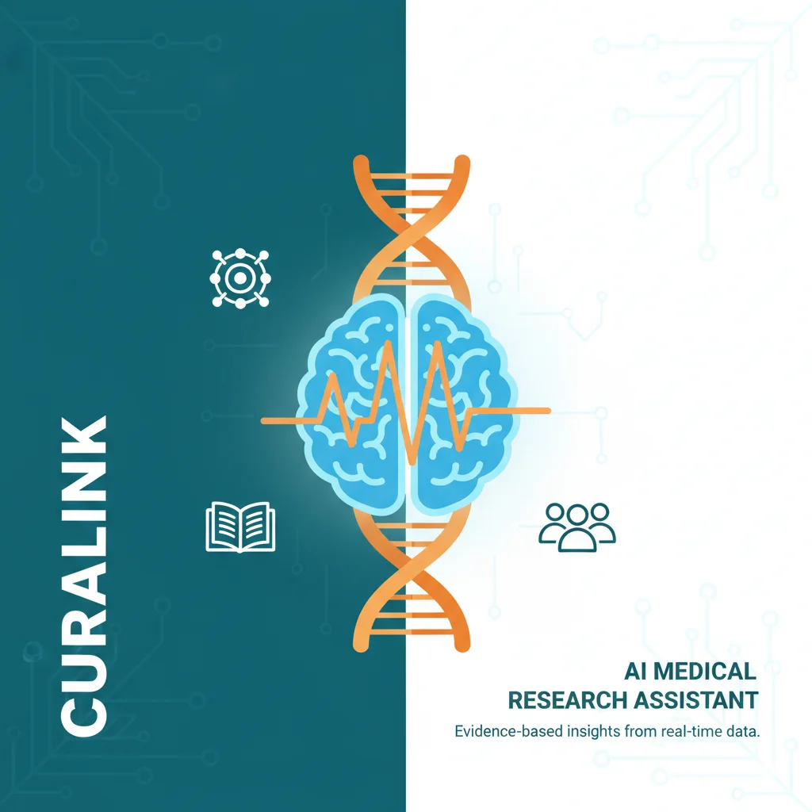

# 🧬 Curalink — Frontend

> **AI Medical Research Assistant · Modern React Interface**



**Curalink** is a AI medical research assistant.  
This repository contains the **frontend client** — a responsive, accessible, and real‑time chat interface that visualises the entire research pipeline.

---

## ✨ Features

- 🧠 **Research Pipeline Visualisation** — Watch as the AI retrieves, deduplicates, and ranks papers live.
- 💬 **Multi‑turn Context** — The assistant remembers your disease and filters follow‑up questions intelligently.
- 📑 **Structured Output** — Insights are displayed with clickable citations and verifiable snippets.
- 🧪 **Clinical Trials Tab** — Direct links to relevant studies on ClinicalTrials.gov.
- 📱 **Fully Responsive** — Mobile‑first design that works flawlessly on any device.
- ♿ **WCAG 2.1 AA Compliant** — Accessible colour contrast and keyboard navigation.

---

## 🛠️ Tech Stack

| Category          | Technology                                          |
| ----------------- | --------------------------------------------------- |
| Build Tool        | [Vite](https://vitejs.dev/)                         |
| Language          | TypeScript                                          |
| UI Framework      | React 18                                            |
| Styling           | Tailwind CSS + [shadcn/ui](https://ui.shadcn.com/)  |
| State Management  | Zustand                                             |
| Data Fetching     | TanStack Query + Axios                              |
| Real‑time Updates | Server‑Sent Events (SSE)                            |
| Animations        | Framer Motion                                       |
| Icons             | Lucide React                                        |

---

## 📦 Getting Started

### Prerequisites

- Node.js 18+
- A running instance of the [Curalink Backend](https://github.com/yourusername/curalink-backend) (or use the deployed Render URL)

### Installation

```bash
# 1. Clone the repository
git clone https://github.com/yourusername/curalink-frontend.git
cd curalink-frontend

# 2. Install dependencies
npm install

# 3. Set up environment variables
cp .env.example .env.local
# Edit .env.local – add your backend URL

# 4. Start the development server
npm run dev
```

The app will be available at `http://localhost:5173`.

---

## 🔧 Environment Variables

Create a `.env.local` file in the root directory with the following:

```env
VITE_API_URL=http://localhost:5000
```

| Variable         | Description                                      | Example                                 |
| ---------------- | ------------------------------------------------ | --------------------------------------- |
| `VITE_API_URL`   | URL of the Curalink backend (JSON and SSE APIs)  | `https://curalink-api.onrender.com`     |

---

## 🧪 Available Scripts

| Command           | Description                                     |
| ----------------- | ----------------------------------------------- |
| `npm run dev`     | Start the development server with hot reload    |
| `npm run build`   | Build the project for production                |
| `npm run preview` | Locally preview the production build            |
| `npm run lint`    | Run ESLint to check code quality                |

---

## 📁 Project Structure

```
src/
├── api/                 # Axios instance & TanStack Query hooks
├── components/          # Shared UI components (Header, Logo, etc.)
├── features/chat/       # Chat‑specific components and hooks
│   ├── components/      # MessageList, ChatInput, ResearchFunnel, etc.
│   └── hooks/           # useStreamQuery, useSession
├── lib/                 # Constants and utility functions
├── store/               # Zustand store (session, messages)
├── styles/              # Global CSS and Tailwind imports
├── types/               # TypeScript interfaces
├── App.tsx
└── main.tsx
```

---

## 🚀 Deployment

The frontend is a static site and can be deployed to any static hosting provider.

### Recommended Platforms

| Platform | Free Tier | Setup Time |
| -------- | --------- | ---------- |
| [Vercel](https://vercel.com) | ✅ Generous | 2 minutes |
| [Netlify](https://netlify.com) | ✅ Very generous | 2 minutes |
| [Cloudflare Pages](https://pages.cloudflare.com) | ✅ Unlimited | 3 minutes |

### Deploy to Vercel (Quick Steps)

1. Push your code to a Git repository (GitHub, GitLab, or Bitbucket).
2. Visit [Vercel](https://vercel.com) and click **"New Project"**.
3. Import your repository.
4. Add the environment variable `VITE_API_URL` pointing to your deployed backend.
5. Click **"Deploy"**.

Your app will be live at `https://curalink.vercel.app`.

---

## 🖼️ Open Graph Image

The image `public/og-image.` is used for social sharing previews (Open Graph and Twitter Cards).  
It was generated using the following prompt:

> *"Modern flat vector illustration. Split gradient background (teal & white). Central glowing brain with DNA helix, surrounded by icons for PubMed, OpenAlex, and ClinicalTrials. Text: CURALINK · AI MEDICAL RESEARCH ASSISTANT."*

---

## 👤 Author

**Your Name**  
[GitHub](https://github.com/tanveer-g) · [LinkedIn](https://linkedin.com/in/tanveer-h1)

---

## 📄 License

MIT — feel free to use, modify, and distribute.

---

**Built with ❤️ for the Curalink Hackathon.**